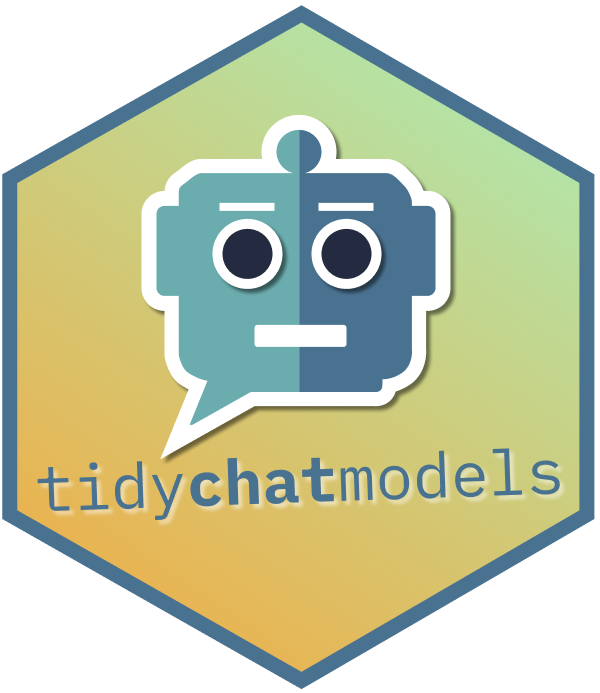

# tidychatmodels



## About this package

This package provides a simple interface to chat with your favorite AI
chatbot from R. It is inspired by the modular nature of `{tidymodels}`
where you can easily swap out any ML model for another one but keep the
other parts of the workflow the same. In the same vain, this package
aims to communicate with different chatbot vendors like
[openAI](https://platform.openai.com/docs/api-reference/making-requests),
[mistral.ai](https://docs.mistral.ai/api/), etc. using the same
interface.

Basically, this package is a wrapper around the API of different
chatbots and provides a unified interface to communicate with them. The
underlying package that handles all the communication is the
[`{httr2}`](https://httr2.r-lib.org/) package. For a deep dive into
`{httr2}`, you could check out one of my tutorials [on
YouTube](https://youtu.be/hmtE4QGIOuk).

## Video walkthrough

If you want to get a video walkthrough for this package, check out:

<iframe width="560" height="315" src="https://www.youtube.com/embed/RjtADzX-sJY?si=ZdyPZxp3Meaqxt4j" title="YouTube video player" frameborder="0" allow="accelerometer; autoplay; clipboard-write; encrypted-media; gyroscope; picture-in-picture; web-share" allowfullscreen>
</iframe>

## Installation

Currently this package is only available on GitHub. To install it, you
will need to use the `devtools` package.

``` r
# install.packages("devtools")
devtools::install_github("AlbertRapp/tidychatmodels")
```

## Getting Started

What you will need to get started is an API key from the chatbot vendor
you want to use. For example, to use the openAI chatbot, you will need
to sign up for an API key [here](https://platform.openai.com/api-keys).
Once you have that key, you can use it to authenticate with the openAI
API. I recommend saving the key into a `.env` file and loading the key
into your R environment using the `{dotenv}` package.

``` r
dotenv::load_dot_env('../.env')
library(tidychatmodels)
chat_openai <- create_chat('openai', Sys.getenv('OAI_DEV_KEY'))
chat_openai
## Chat Engine: openai 
## Messages: 0
```

Afterwards, you can add a model to the chat object. In this case, we are
adding the `gpt-3.5-turbo` model. The user is responsible for knowing
which models are available at a vendor like OpenAI.

``` r
chat_openai |>
  add_model('gpt-3.5-turbo')
## Chat Engine: openai 
## Messages: 0 
## Model: gpt-3.5-turbo
```

Similarly, you can add parameters to the chat object.

``` r
create_chat('openai', Sys.getenv('OAI_DEV_KEY'))|>
  add_model('gpt-3.5-turbo') |>
  add_params('temperature' = 0.5, 'max_tokens' = 100)
## Chat Engine: openai 
## Messages: 0 
## Model: gpt-3.5-turbo 
## Parameters: 
##    temperature: 0.5 
##    max_tokens: 100
```

Afterwards, you can add messages to your chat object using different
roles. Typically, you might first use a system manage to set the stage
for what you bot is required to do. Afterwards, you can add a user
message.

``` r
chat_openai <- create_chat('openai', Sys.getenv('OAI_DEV_KEY'))|>
  add_model('gpt-3.5-turbo') |>
  add_params(temperature = 0.5, max_tokens = 100) |>
  add_message(
    role = 'system',
    message = 'You are a chatbot that completes texts.
    You do not return the full text.
    Just what you think completes the text.'
  ) |> 
  add_message(
    # default role = 'user'
    '2 + 2 is 4, minus 1 that\'s 3, '
  ) 
chat_openai
## Chat Engine: openai 
## Messages: 2 
## Model: gpt-3.5-turbo 
## Parameters: 
##    temperature: 0.5 
##    max_tokens: 100
```

At this stage, you haven’t actually started any chat with the bot. You
can do so by calling the `perform_chat` method. Beware that this will
consume your API calls and will likely incur costs. Once the chat is
performed, you can extract the chat from the chat object.

``` r
chat_openai <- chat_openai |> perform_chat()
chat_openai |> extract_chat()
## System: You are a chatbot that completes texts.
##     You do not return the full text.
##     Just what you think completes the text. 
## User: 2 + 2 is 4, minus 1 that's 3,  
## Assistant: Quick maths!
```

Excellent! ChatGPT seems to know the next line of this [glorious
song](https://www.youtube.com/watch?v=M3ujv8xdK2w&ab_channel=musiclyrics).
Also, you can save the chat into a tibble. If you want to surpress the
output of the chat, you can use the `silent` parameter.

``` r
msgs <- chat_openai |> extract_chat(silent = TRUE)
msgs
## # A tibble: 3 × 2
##   role      message                                                             
##   <chr>     <chr>                                                               
## 1 system    "You are a chatbot that completes texts.\n    You do not return the…
## 2 user      "2 + 2 is 4, minus 1 that's 3, "                                    
## 3 assistant "Quick maths!"
```

You could add another message to the chat by adding a user message and
then performing the chat again. While we’re at it, let’s just modify the
`temperature` parameter to for this new reply.

``` r
chat_openai <- chat_openai |> 
  add_message(
    role = 'user',
    message = 'Make it cooler!'
  ) |> 
  add_params(temperature = 0.9) |> 
  perform_chat()

chat_openai |> extract_chat()
## System: You are a chatbot that completes texts.
##     You do not return the full text.
##     Just what you think completes the text. 
## User: 2 + 2 is 4, minus 1 that's 3,  
## Assistant: Quick maths! 
## User: Make it cooler! 
## Assistant: Everyday man's on the block, smoke trees.
```

Ah yes, that’s much cooler. But beware, this sent the whole chat again
and consumed another API call.

### Switching to another vendor

Let’s recap our full workflow.

``` r
create_chat('openai', Sys.getenv('OAI_DEV_KEY')) |>
  add_model('gpt-3.5-turbo') |>
  add_params(temperature = 0.5, max_tokens = 100) |>
  add_message(
    role = 'system',
    message = 'You are a chatbot that completes texts.
    You do not return the full text.
    Just what you think completes the text.'
  ) |> 
  add_message(
    # default role = 'user'
    '2 + 2 is 4, minus 1 that\'s 3, '
  ) |> 
  perform_chat()
```

You can easily switch so some other vendor now. For example, let’s go
for the `mistral-large-latest` model from
[Mistral.ai](https://docs.mistral.ai/api/).

``` r
mistral_chat <- create_chat('mistral', Sys.getenv('MISTRAL_DEV_KEY')) |>
  add_model('mistral-large-latest') |>
  add_params(temperature = 0.5, max_tokens = 100) |>
  add_message(
    role = 'system',
    message = 'You are a chatbot that completes texts.
    You do not return the full text.
    Just what you think completes the text.'
  ) |> 
  add_message(
    # default role = 'user'
    '2 + 2 is 4, minus 1 that\'s 3, '
  ) |> 
  perform_chat()
mistral_chat |> extract_chat()
## System: You are a chatbot that completes texts.
##     You do not return the full text.
##     Just what you think completes the text. 
## User: 2 + 2 is 4, minus 1 that's 3,  
## Assistant: and if you add 5, that makes 8.
```

## Supported vendors

Currently only supported vendors are openAI, mistral.ai and
[ollama](https://ollama.com/). ollama allows you to deploy local LLMs
and chat with them through `localhost`. The ollama’s API is a bit
different but on our `tidychatmodels` interface everything should still
works the same or be at least very similar.

For example, creating a chat works pretty much the same but doesn’t
require an API key.

``` r
create_chat('ollama') 
## Chat Engine: ollama 
## Messages: 0 
## Parameters: 
##    stream: FALSE
```

Notice how there is already a parameter `stream` that is set to `false`.
This is a change in the API of the ollama chat engine. You see, by
default ollama will stream the reply token by token. But `{httr2}`
doesn’t want that (or rather I didn’t bother looking into how to do that
with `{httr2}`). So that’s why by default we set `stream` to `false`.

Now, you can add a local model to your chat. So, assume that you ran
(outside of R)

``` r
ollama pull gemma:7b
```

Then you can add the model to your chat object.

``` r
create_chat('ollama') |>
  add_model('gemma:7b')
## Chat Engine: ollama 
## Messages: 0 
## Model: gemma:7b 
## Parameters: 
##    stream: FALSE
```

And just like before, you can add messages and perform the chat. Beware
though that for some models system messages are not actually working
like for openAI or mistral.ai models. So here I’ve only added a user
message.

``` r
ollama_chat <- create_chat('ollama') |>
  add_model('gemma:7b') |> 
  add_message('What is love? IN 10 WORDS.') |> 
  perform_chat() 

ollama_chat |> 
  extract_chat()
## User: What is love? IN 10 WORDS. 
## Assistant: Love is a complex and multifaceted emotion, but in 10 words, it can be defined as a deep and enduring connection with another person characterized by intimacy, affection, and mutual respect.
```

And adding more messages works too.

``` r
ollama_chat <- ollama_chat |> 
  add_message('Now describe hate in 10 words') |> 
  perform_chat() 

ollama_chat |> 
  extract_chat()
## User: What is love? IN 10 WORDS. 
## Assistant: Love is a complex and multifaceted emotion, but in 10 words, it can be defined as a deep and enduring connection with another person characterized by intimacy, affection, and mutual respect. 
## User: Now describe hate in 10 words 
## Assistant: Hate is an intense feeling of dislike or disgust towards a person or group, often accompanied by a desire to harm or punish them.
```

``` r
msgs <- ollama_chat |> extract_chat()
## User: What is love? IN 10 WORDS. 
## Assistant: Love is a complex and multifaceted emotion, but in 10 words, it can be defined as a deep and enduring connection with another person characterized by intimacy, affection, and mutual respect. 
## User: Now describe hate in 10 words 
## Assistant: Hate is an intense feeling of dislike or disgust towards a person or group, often accompanied by a desire to harm or punish them.

ollama_chat |> 
  add_message(
    paste(
      'You said: "',
      msgs$message[2], 
      msgs$message[4],
      '" Is there a relationship between these two?'
    )
  ) |> 
  perform_chat() |> 
  extract_chat()
## User: What is love? IN 10 WORDS. 
## Assistant: Love is a complex and multifaceted emotion, but in 10 words, it can be defined as a deep and enduring connection with another person characterized by intimacy, affection, and mutual respect. 
## User: Now describe hate in 10 words 
## Assistant: Hate is an intense feeling of dislike or disgust towards a person or group, often accompanied by a desire to harm or punish them. 
## User: You said: " Love is a complex and multifaceted emotion, but in 10 words, it can be defined as a deep and enduring connection with another person characterized by intimacy, affection, and mutual respect. Hate is an intense feeling of dislike or disgust towards a person or group, often accompanied by a desire to harm or punish them. " Is there a relationship between these two? 
## Assistant: Sure, there is a relationship between love and hate. Hate is often the opposite of love. When we hate someone, we often have negative feelings towards them, such as anger, resentment, and fear. Conversely, when we love someone, we often have positive feelings towards them, such as happiness, compassion, and understanding.
```
